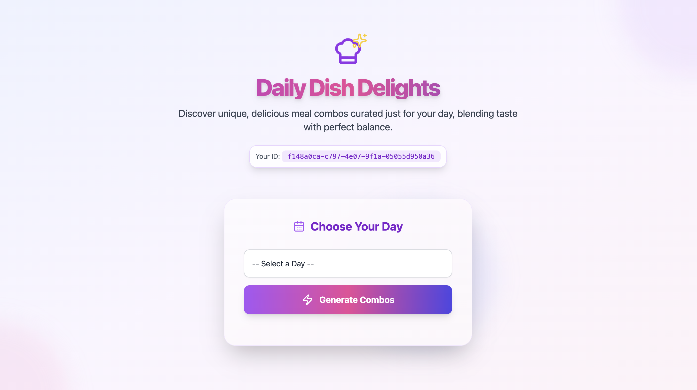
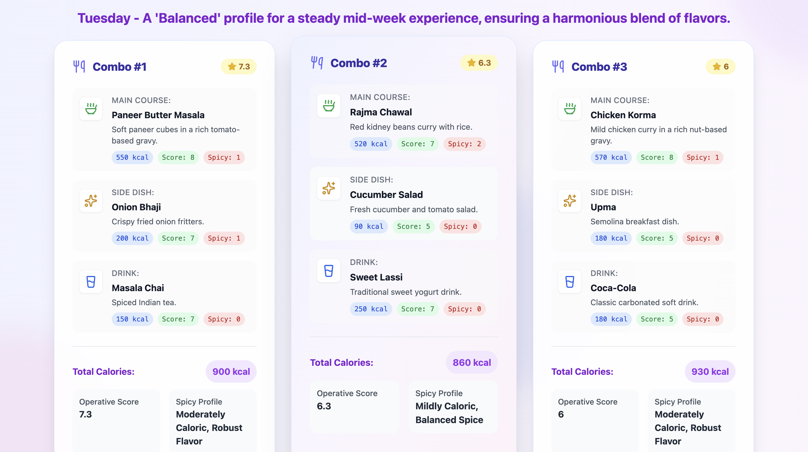
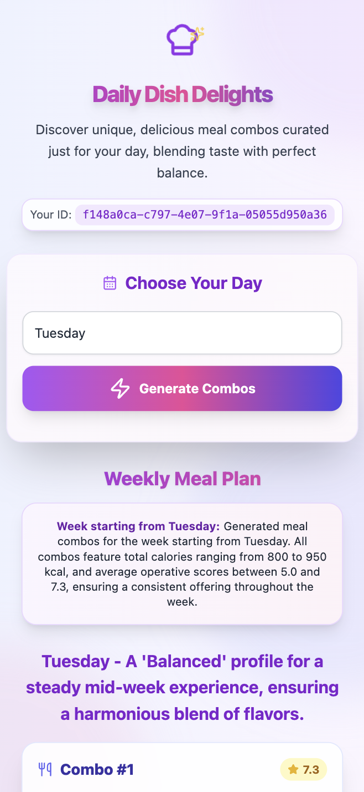

# Daily Dish Delights - Weekly Meal Combo Generator

A beautiful, responsive web application that generates personalized meal combinations for the entire week. The app features a modern, attractive design with smooth animations and excellent mobile responsiveness.

## 🌐 Live Demo  
Check out the live version here:

[](https://meal-combo-generator.vercel.app/)


## 📸 Screenshots

### 🖥️ Home View


### Meal for all day
 

### ComboMeal view


### 📱 Mobile View



## ✨ Features

### 🍽️ Weekly Meal Planning
- **Complete Week Generation**: Select any day to generate combos for all 7 days
- **Day-Specific Profiles**: Each day has unique flavor profiles (sweet, balanced, spicy)
- **Fresh Combos Every Time**: Randomized combinations for variety
- **Smart Uniqueness**: Ensures variety across the week while maintaining day-specific themes

### 🎨 Enhanced Design
- **Modern UI**: Beautiful gradient backgrounds with animated floating elements
- **Glass Morphism**: Translucent cards with backdrop blur effects
- **Smooth Animations**: Hover effects, loading animations, and micro-interactions
- **Gradient Text**: Animated gradient text effects for headings
- **Custom Scrollbar**: Styled scrollbar with gradient colors

### 📱 Responsive Design
- **Mobile-First**: Optimized for all screen sizes from mobile to desktop
- **Flexible Layout**: Adaptive grid system that works on all devices
- **Touch-Friendly**: Large touch targets and proper spacing for mobile users
- **Responsive Typography**: Text scales appropriately across devices
- **Adaptive Spacing**: Padding and margins adjust for different screen sizes

### 🎯 User Experience
- **Intuitive Interface**: Clear visual hierarchy and easy navigation
- **Loading States**: Engaging loading animations with progress indicators
- **Error Handling**: User-friendly error messages with icons
- **Accessibility**: Proper focus states and semantic HTML
- **Performance**: Optimized animations and smooth transitions

## 🚀 Technologies Used

- **Frontend**: React.js with modern hooks
- **Styling**: Tailwind CSS with custom animations
- **Icons**: Lucide React for beautiful, consistent icons
- **Backend**: Node.js/Express with robust combo generation
- **Database**: Local storage with Firebase fallback (optional)

## 🍽️ How It Works

### Weekly Generation
1. **Select a Day**: Choose any day of the week
2. **Generate Combos**: Creates 21 unique combos (3 per day for 7 days)
3. **Day Profiles**: Each day has specific flavor characteristics:
   - **Monday**: Sweet profile (comforting start)
   - **Tuesday-Thursday**: Balanced profile (steady mid-week)
   - **Friday-Saturday**: Spicy profile (bold weekend)
   - **Sunday**: Sweet profile (delightful end)

### Example Output
Select **Saturday** → Generates: Saturday, Sunday, Monday, Tuesday, Wednesday, Thursday, Friday

## 🎨 Design System

### Color Palette
- **Primary**: Purple gradient (#8b5cf6 to #ec4899)
- **Secondary**: Indigo and pink accents
- **Background**: Soft gradient from indigo to purple to pink
- **Text**: Dark gray with proper contrast ratios

### Typography
- **Headings**: Bold, gradient text with drop shadows
- **Body**: Clean, readable fonts with proper line heights
- **Responsive**: Scales from mobile to desktop sizes

### Animations
- **Hover Effects**: Subtle scale and shadow changes
- **Loading**: Spinning loaders with dual-ring design
- **Background**: Floating blob animations
- **Transitions**: Smooth 300ms transitions for all interactions

## 📱 Responsive Breakpoints

- **Mobile**: < 640px (sm)
- **Tablet**: 640px - 1024px (md)
- **Desktop**: > 1024px (lg)
- **Large Desktop**: > 1280px (xl)

## 🚀 Getting Started

### Prerequisites
- Node.js (v14 or higher)
- npm or yarn

### Installation

1. **Clone the repository**
   ```bash
   git clone <repository-url>
   cd combo-generator-app
   ```

2. **Install Frontend Dependencies**
   ```bash
   cd frontend
   npm install
   ```

3. **Install Backend Dependencies**
   ```bash
   cd ../backend
   npm install
   ```

4. **Start Backend Server**
   ```bash
   cd backend
   node app.js
   ```
   The backend will run on `http://localhost:3001`

5. **Start Frontend Development Server**
   ```bash
   cd frontend
   npm start
   ```
   The frontend will run on `http://localhost:3000`

6. **Open your browser** and navigate to `http://localhost:3000`

## 🔧 Configuration

### Backend Environment Variables
Create a `.env` file in the `backend` directory:

```env
# Server Configuration
PORT=3001
NODE_ENV=development

# Firebase Configuration (Optional)
# APP_ID=your-firebase-app-id
# FIREBASE_SERVICE_ACCOUNT={"type":"service_account","project_id":"your-project-id"}
# INITIAL_AUTH_TOKEN=your-initial-auth-token
```

### Firebase Setup (Optional)
The app works without Firebase, but if you want to enable it:
1. Create a Firebase project
2. Add your credentials to the `.env` file
3. The app will use Firebase for combo uniqueness tracking

## 🎯 Key Features

1. **Weekly Meal Planning**
   - Generate 21 unique combos (3 per day for 7 days)
   - Day-specific flavor profiles
   - Smart uniqueness across the week

2. **Enhanced Visual Appeal**
   - Animated background elements
   - Glass morphism effects
   - Gradient text animations
   - Custom scrollbar styling

3. **Improved Responsiveness**
   - Mobile-first design approach
   - Flexible grid layouts
   - Responsive typography and spacing
   - Touch-friendly interface elements

4. **Robust Backend**
   - Reliable combo generation
   - Fallback mechanisms
   - Error handling
   - Performance optimization

## 📱 Mobile Experience

The app is fully optimized for mobile devices with:
- Touch-friendly buttons and controls
- Responsive card layouts
- Optimized text sizes for mobile reading
- Smooth scrolling and interactions
- Proper viewport settings

## 🎨 Customization

The design system is easily customizable through:
- Tailwind CSS configuration
- CSS custom properties
- Component-based styling
- Modular animation system

## 🔧 Technical Details

- **Frontend**: Create React App with Tailwind CSS
- **Backend**: Node.js/Express with robust combo generation
- **Styling**: Tailwind CSS with custom animations
- **Icons**: Lucide React
- **Database**: Local storage with Firebase fallback
- **Responsive**: CSS Grid and Flexbox with Tailwind breakpoints

## 🚀 Production Build

1. **Build Frontend**
   ```bash
   cd frontend
   npm run build
   ```

2. **Start Production Backend**
   ```bash
   cd backend
   NODE_ENV=production node app.js
   ```

---

**Daily Dish Delights** - Where every week is a culinary adventure! 🍽️✨
